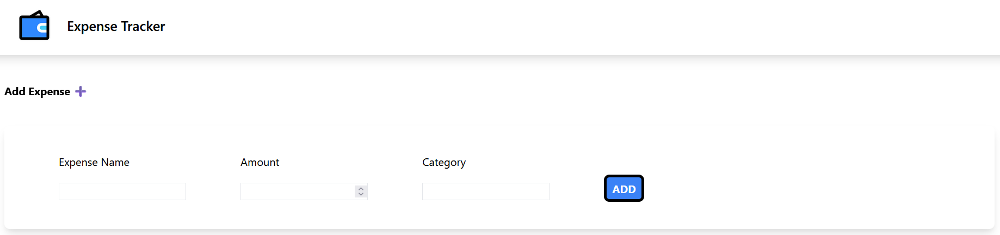
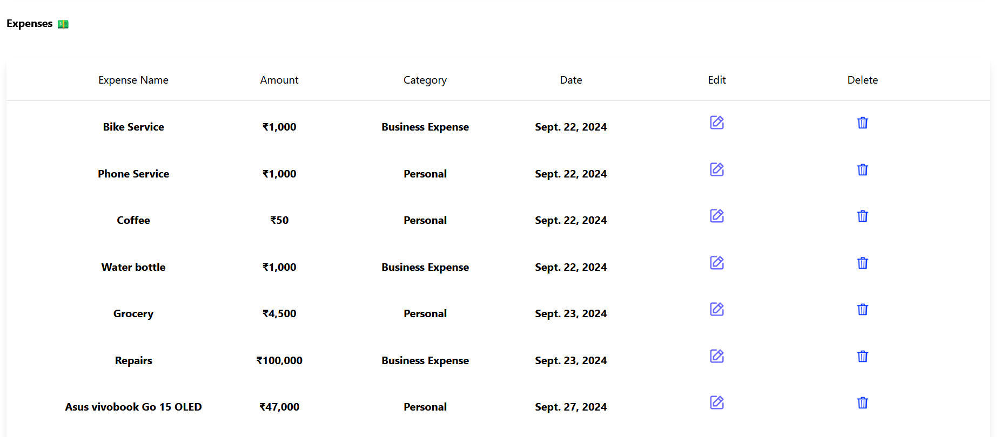
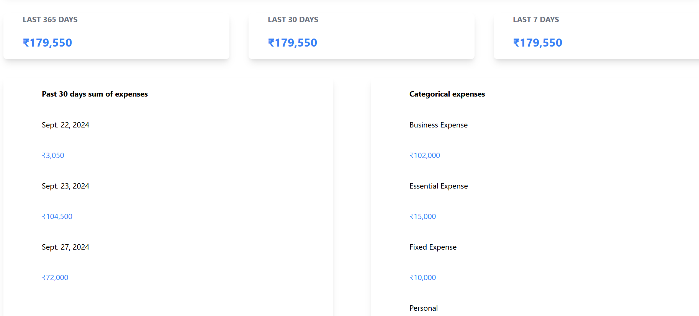
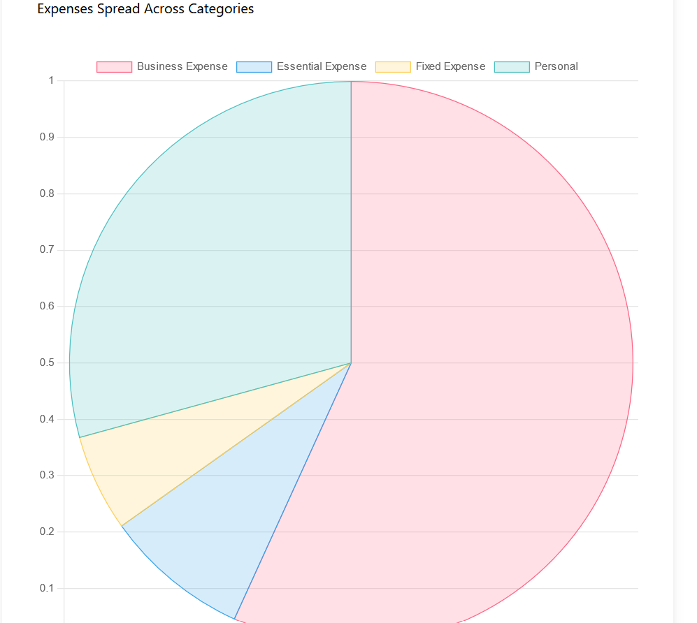
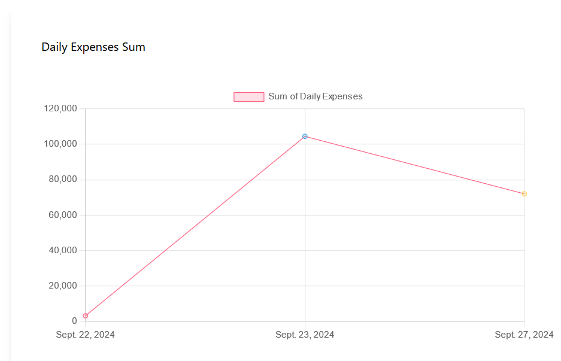

# Expense Tracker

## Description
The Expense Tracker is a web application that helps users manage their personal finances by tracking their income and expenses. Users can easily add, edit, and delete transactions, categorize their spending, and visualize their financial data through charts.

## Features
- User authentication (registration and login)
- Add, edit, and delete transactions
- Categorize expenses (e.g., food, entertainment, utilities)
- View spending history
- Data visualization through charts
- Responsive design for mobile and desktop

## Technologies Used
- **Frontend**: HTML, CSS, JavaScript
- **Backend**: Django
- **Database**: SQLite (or specify if using another)
- **Libraries**: Chart.js (for data visualization), Bootstrap (for styling)

## Screenshots

### Home Page:
 

### All Expenses:

### Past year/month/week expenses with categories

### View in Pie Chart

### View in Line Chart
